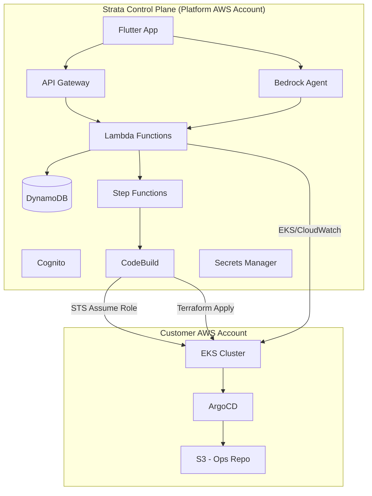
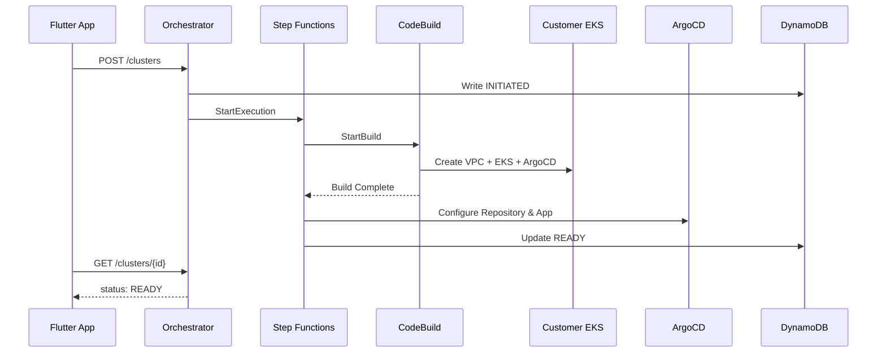
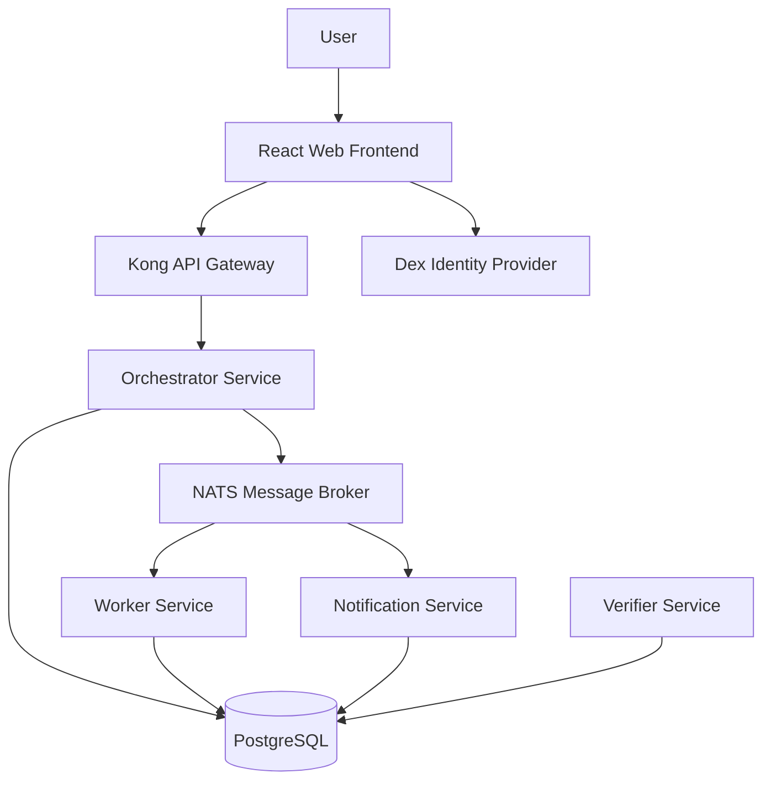

# Strata

Cloud-native infrastructure is built in layers — compute, network, storage, orchestration, observability. Each layer has its own objects, its own state, its own drift. Strata is the platform that helps you see, query, and manage across all those layers at once.

<!-- IMAGE: Strata Platform Architecture Overview -->


---

## Table of Contents

- [Overview](#overview)
- [Architecture](#architecture)
- [How It Works](#how-it-works)
- [Sample Application](#sample-application)
- [Getting Started](#getting-started)
- [Project Structure](#project-structure)
- [Documentation](#documentation)

---

## Overview

Strata provisions production-grade EKS clusters in customer AWS accounts via GitOps and a serverless control plane. Users connect their GitHub repos and AWS accounts, and Strata handles the rest — infrastructure provisioning, ArgoCD setup, and continuous monitoring with an AI-powered Co-Pilot.

### Prerequisites

- Users must have at least 2 repositories in GitHub: a **code repo** (application code) and an **ops repo** (for GitOps manifests).
- Users must have an **AWS account with root/admin access** to deploy the initial CloudFormation template that provisions necessary IAM roles.

---

## Architecture

### High-Level Architecture



### Cluster Provisioning Flow



### Sample Application Architecture

The sample application mirrors the Strata serverless backend as a cloud-native Kubernetes deployment:

<!-- IMAGE: Sample App Flow -->




---

## How It Works

### 1. Onboarding

1. User signs up via Flutter app (Cognito)
2. User connects GitHub via OAuth2 (token stored in Secrets Manager)
3. User deploys `onboarding_cfn.yaml` to their AWS account (creates cross-account IAM roles)
4. Strata verifies IAM setup via `sts:AssumeRole`

### 2. AI Code Analysis (Optional)

Before provisioning, the Co-Pilot can analyze the user's codebase:
- Identifies frameworks and logging gaps
- Generates OpenTelemetry instrumentation
- Creates Dockerfile and Kubernetes manifests
- User commits manifests to their ops repo

### 3. Cluster Provisioning

1. User triggers provisioning from Flutter app (specifies cluster name, region, instance type, ops repo URL)
2. `orchestrator` Lambda writes `INITIATED` to DynamoDB and starts Step Functions
3. Step Functions invokes CodeBuild which runs Terraform in the customer account
4. EKS cluster is created with VPC, ArgoCD via Helm
5. `argocd_deployer` configures ArgoCD to sync from the user's ops repo
6. Cluster status marked `READY`

### 4. Continuous Monitoring

- **Proactive:** EventBridge triggers `health_monitor` Lambda every 5 minutes — checks EKS status, CPU/memory, pod crashes
- **Reactive:** Bedrock Co-Pilot answers natural language queries about cluster health, logs, and debugging

### 5. Cluster Deprovisioning

User triggers delete from app → `orchestrator` updates status to `DELETING` → Step Functions runs `terraform destroy` via CodeBuild

---

## Sample Application

The `sample-app/` directory contains a sample application that serves as a deployment target for Strata-provisioned EKS clusters. It is a cloud-native mirror of the Strata serverless backend.

### Services

| Service | Port | Description |
|---------|------|-------------|
| catalog-service | 8081 | Service and team registry |
| provisioner-service | 8082 | Infrastructure provisioning simulator |
| scorecard-service | 8083 | Service health scoring |
| workflow-service | 8084 | Workflow orchestration engine |
| audit-service | 8085 | Audit event logging |

### Infrastructure Stack

- **Database:** PostgreSQL (replaces DynamoDB)
- **Messaging:** NATS (replaces SNS/SQS/EventBridge)
- **API Gateway:** Kong
- **Authentication:** Dex (replaces Cognito)
- **Service Mesh:** Linkerd
- **GitOps:** ArgoCD
- **Observability:** OpenTelemetry, Prometheus, Jaeger, Grafana

### Development

```bash
# Local Docker Compose development
docker-compose -f sample-app/docker-compose.yml up

# Kind cluster development
kind create cluster
cd sample-app && tilt up
```

### Running CI Workflows Locally

Use [act](https://github.com/nektos/act) to run GitHub Actions workflows locally without pushing commits.

**Installation:**
```bash
curl -sL https://github.com/nektos/act/releases/download/v0.2.88/act_Linux_x86_64.tar.gz | tar -xz
mv act ~/bin/act
```

**Configuration** (`~/.config/act/actrc`):
```
-P ubuntu-latest=ghcr.io/catthehacker/ubuntu:runner-latest
```

**Usage:**
```bash
# Run specific workflow
act -W .github/workflows/node-service.yml          # Portal UI
act -W .github/workflows/go-services.yml           # Go services (all 5 in parallel)

# Run specific job
act -W .github/workflows/go-services.yml -j build-test-lint-scan-deploy

# Use cached actions (faster, no network)
act --action-offline-mode
```

---

## Getting Started

### Prerequisites

- AWS CLI configured
- Terraform >= 1.8
- Docker + Docker Compose
- Go 1.22+
- Node.js 20+
- Flutter SDK (for app development)

### Setup

1. **Deploy Strata Control Plane (Infrastructure)**
   ```bash
   cd infra
   terraform init
   terraform plan
   terraform apply
   ```

2. **Package and Deploy Lambdas**
   ```bash
   cd lambdas
   bash package.sh
   ```

3. **Run Sample App Locally**
   ```bash
   docker-compose -f sample-app/docker-compose.yml up
   ```

4. **Deploy Sample App to EKS (after cluster provisioning)**
   ```bash
   # ArgoCD syncs from sample-app/k8s/ manifests
   ```

---

## Project Structure

```
├── .github/
│   └── workflows/          # CI/CD workflows
├── sample-app/             # Sample application (EKS deployment target)
│   ├── services/           # Go microservices
│   ├── portal-ui/          # React frontend
│   ├── docker-compose.yml  # Local development
│   └── Tiltfile            # Kind cluster development
├── flutter_app/            # Flutter mobile + web app
├── infra/                  # Strata control plane Terraform
├── lambdas/                # Strata serverless backend (Python)
│   └── orchestrator/       # Only lambda implemented
├── terraform/
│   └── aws/                # EKS cluster Terraform module
├── specs/                  # Design documents and architecture specs
├── diagrams/               # Architecture diagrams
├── buildspec.yml           # CodeBuild specification
└── onboarding_cfn.yaml     # Customer CloudFormation template
```

---

## Documentation

- [Master Design Document](./specs/strata_master_doc.md) — Full platform specification
- [Sample App Architecture](./specs/sample_app_architecture.md) — Sample app design
- [AGENTS.md](./AGENTS.md) — Developer instructions for AI assistants
- [sample-app/AGENTS.md](./sample-app/AGENTS.md) — Sample app Go services lint rules

---

## Images

<!-- Add architecture and screenshot images below -->

<!--  -->
<!--  -->
<!--  -->