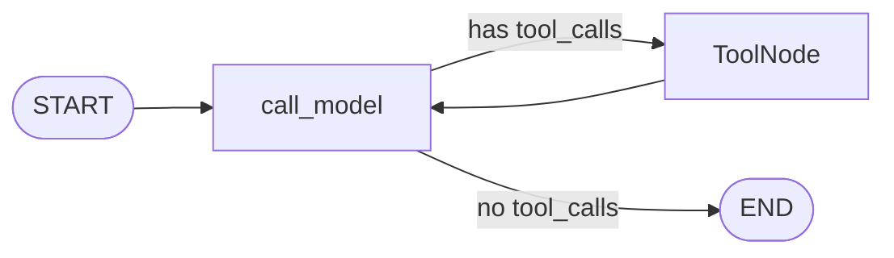

# LangGraph

The state-machine library that sits on top of LangChain. Strata's
agent loop is a LangGraph `StateGraph`: a typed state, nodes
that update it, and conditional edges that route between them.

Read [`langchain.md`](langchain.md) first — LangGraph assumes
you understand messages, `BaseChatModel`, and `BaseTool`.

---

## How this doc is organized

The deep-dive is split across 12 focused files. Read in order
for a full mental model, or jump to a single file for a
reference.

| File | What it covers |
|---|---|
| [01-mental-model.md](langgraph/01-mental-model.md) | Why a state machine, the four concepts (state, nodes, edges, channels), `compile()` and run, vs. alternatives, package layout, the functional API. |
| [02-state-and-reducers.md](langgraph/02-state-and-reducers.md) | `TypedDict` schemas, `add_messages` reducer, custom reducers, `state_schema` / `input_schema` / `output_schema`, runtime context. |
| [03-nodes-and-edges.md](langgraph/03-nodes-and-edges.md) | `add_node` (with metadata, retry, cache_policy), `add_edge` from `START` / `END`, conditional edges, `path_map`, `Send` for map-reduce. |
| [04-command-and-control-flow.md](langgraph/04-command-and-control-flow.md) | `Command(goto, update, graph, resume)`, dynamic routing, `Command.PARENT`, the `interrupt()` function. |
| [05-toolnode-and-tools_condition.md](langgraph/05-toolnode-and-tools_condition.md) | `ToolNode` deep dive, parallel tool calls, `handle_tool_errors`, `tools_condition` source, custom routers. |
| [06-subgraphs-and-map-reduce.md](langgraph/06-subgraphs-and-map-reduce.md) | Subgraphs as nodes, state isolation, `input` / `output` schemas, `Command.PARENT`, `Send` patterns, parallel branches. |
| [07-streaming.md](langgraph/07-streaming.md) | All `stream_mode` values, `astream_events` deep, mapping to Strata's NDJSON and SSE wire formats. |
| [08-checkpoints-and-persistence.md](langgraph/08-checkpoints-and-persistence.md) | `MemorySaver`, `SqliteSaver`, `PostgresSaver`, `thread_id`, `get_state` / `get_state_history`, time travel via `update_state`, `durability` modes. |
| [09-memory-store.md](langgraph/09-memory-store.md) | `InMemoryStore` / `PostgresStore`, namespace conventions, `put` / `get` / `search`, semantic search, per-user facts. |
| [10-human-in-the-loop.md](langgraph/10-human-in-the-loop.md) | `interrupt()`, `Command(resume=...)`, static interrupts, multi-interrupt flows, Strata's mutation-tool confirmation (Phase 6+). |
| [11-deployment-and-debug.md](langgraph/11-deployment-and-debug.md) | `recursion_limit`, `durability`, LangGraph CLI, Studio, debugging recipes, common runtime errors. |
| [12-pitfalls.md](langgraph/12-pitfalls.md) | A consolidated list of "I lost an hour to this" bugs. |

For the foundation layer, see [`langchain.md`](langchain.md)
and the [`langchain/`](langchain/) deep-dive.

---

## The one mental model

A LangGraph graph is **a typed state + a set of nodes + a set
of edges**. Nodes are functions. Edges are either fixed
(`A → B`) or conditional (`A → B if X else C`). The state is a
typed dict (or `TypedDict`) that gets passed to every node.

Each node returns a **partial state update** (a dict). The
framework merges that update into the state using **reducers**
(one per field). When all is said and done, you've got a
state machine that:

1. Starts with the initial state.
2. Runs the entry-point node.
3. Each node returns a partial update.
4. The graph merges the update and picks the next node from
   the outgoing edges (using the conditional function if
   applicable).
5. Reaches `END` and returns the final state.

The crucial thing: **nodes are stateless**. They read from the
state, return a partial update, and the framework does the
merging. This makes the graph testable, resumable, and
inspectable.



---

## The Strata agent loop in 30 lines

```python
from langgraph.graph import StateGraph, START, END
from langgraph.prebuilt import ToolNode, tools_condition
from langgraph.graph.message import add_messages
from typing_extensions import TypedDict, Annotated
from langchain_core.messages import SystemMessage

class AgentState(TypedDict, total=False):
    messages: Annotated[list, add_messages]
    user_id: str

SYSTEM_PROMPT = "You are Strata, an EKS ops copilot. ..."

def build_graph(llm, tools):
    tool_node = ToolNode(tools)

    def call_model(state: AgentState) -> dict:
        messages = [SystemMessage(content=SYSTEM_PROMPT)] + state["messages"]
        response = llm.bind_tools(tools).invoke(messages)
        return {"messages": [response]}

    graph = StateGraph(AgentState)
    graph.add_node("call_model", call_model)
    graph.add_node("tools", tool_node)
    graph.add_edge(START, "call_model")
    graph.add_conditional_edges(
        "call_model",
        tools_condition,
        {"tools": "tools", END: END},
    )
    graph.add_edge("tools", "call_model")
    return graph.compile()
```

That's the entire agent loop. Every other LangGraph feature
(add a checkpointer, add a `retrieve` node for RAG, add a
`confirm` node for HITL, add subgraphs for multi-agent) is
additive on top of this.

---

## How Strata uses this

- **Phase 2:** `StateGraph` with `call_model` and `ToolNode`.
  No checkpointer. No subgraphs. `tools_condition` for routing.
- **Phase 3+:** Add a `retrieve` node for RAG (conditional
  edge from `START`). Add a `summarize` node for context
  window management.
- **Phase 6+:** `PostgresSaver` for the checkpointer. Add a
  `confirm_mutation` node with `interrupt()` for the
  mutation-tool flow. Add `MemoryStore` for cross-thread
  user facts. Add subgraphs for multi-tenant onboarding.

---

## What to read next

- **[`langgraph/01-mental-model.md`](langgraph/01-mental-model.md)**
  — the four concepts, `compile()`, the agent-loop mental
  model.
- **[`langgraph/02-state-and-reducers.md`](langgraph/02-state-and-reducers.md)**
  — the state schema, `add_messages`, runtime context.
- **[`langgraph/05-toolnode-and-tools_condition.md`](langgraph/05-toolnode-and-tools_condition.md)**
  — the standard `ToolNode` + `tools_condition` flow.
- **[`langgraph/08-checkpoints-and-persistence.md`](langgraph/08-checkpoints-and-persistence.md)**
  — the checkpointer for production durability.
- **[`langgraph/10-human-in-the-loop.md`](langgraph/10-human-in-the-loop.md)**
  — the mutation-tool confirmation flow, Phase 6+.
- **[`strata/agent-architecture.md`](strata/agent-architecture.md)**
  — how Strata actually uses all of this.
- LangGraph docs: <https://langchain-ai.github.io/langgraph/>
- LangGraph concepts: <https://langchain-ai.github.io/langgraph/concepts/>
