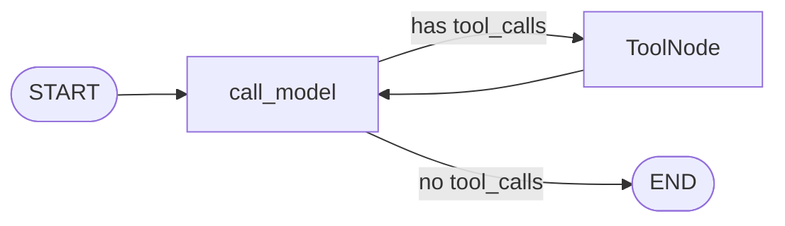

# LangGraph — Mental Model

> **Part 1 of the LangGraph deep-dive.** Why a state machine,
> what the four concepts are (state, nodes, edges, channels),
> and how LangGraph relates to LangChain and to "the agent
> loop" intuition.

LangGraph is a state-machine library that sits on top of
LangChain. The whole library is roughly four concepts:

1. **State** — a typed dict that gets passed to every node.
2. **Nodes** — functions that read state and return a partial
   update.
3. **Edges** — fixed (`A → B`) or conditional (`A → B if X else C`).
4. **Channels** — the plumbing that merges partial updates into
   the state (reducers).

That's the whole library. Everything else (`ToolNode`,
`tools_condition`, checkpointers, stores, interrupts) is built
on top of these four.

---

## 1. Why a state machine?

The agent loop is:

```
   START
     │
     ▼
  call_model  ───────────► END
     │  ▲                     ▲
     │  │                     │
     ▼  │                     │
  ToolNode ───────────────────┘
```

This is a **cyclic graph** with **conditional routing** based
on the model's output. You cannot express this with chains
(`prompt | model | parser`). You cannot express it cleanly with
plain Python (durable state, time travel, and human-in-the-loop
become a re-implementation of LangGraph).

LangGraph gives you all four:

- **Cyclic graphs** — `add_edge("tools", "call_model")` is a
  back-edge.
- **Conditional routing** — `add_conditional_edges(...)`.
- **Durable state** — a checkpointer (Phase 6+).
- **Time travel** — `get_state_history(config)`.
- **Human-in-the-loop** — `interrupt()` and `Command(resume=...)`.

---

## 2. The four concepts

### State

A `TypedDict` with one or more fields, each annotated with a
**reducer** that controls how partial updates merge.

```python
from typing import Annotated
from langgraph.graph.message import add_messages
from typing_extensions import TypedDict

class AgentState(TypedDict, total=False):
    messages: Annotated[list, add_messages]
    user_id: str
    thread_id: str
```

The state is **the only thing that flows through the graph**.
Every node reads it and returns a partial update. The framework
owns the state object; you never mutate it in place.

### Nodes

A node is a function `(state: State) -> dict | Command`:

```python
def call_model(state: AgentState) -> dict:
    response = llm.invoke(state["messages"])
    return {"messages": [response]}    # partial update
```

A node is **stateless** beyond what it reads from the state.
Side effects (DB calls, HTTP) are allowed; mutating `state` in
place is not.

### Edges

A connection from one node to another. Two kinds:

- **Fixed** — `graph.add_edge("call_model", "tools")`.
- **Conditional** — `graph.add_conditional_edges(source, path_fn, path_map=...)`.

The path function `(state) -> str` decides which outgoing edge
to take. The path map is optional but recommended for
self-documentation.

### Channels (reducers)

The plumbing. A reducer is a function `(current_value, update) -> new_value`.
The default reducer overwrites. `add_messages` (for the
`messages` field) appends and deduplicates.

```python
def add_messages(left: list, right: list | BaseMessage) -> list:
    """Append right to left, replacing any message in left whose id
    matches an id in right."""
```

When a node returns `{"messages": [AIMessage(...)]}`, the
framework uses the `messages` field's reducer to merge. For
`add_messages`, that's an append. For a default (no reducer),
that's a replace.

---

## 3. Compiling and running

```python
from langgraph.graph import StateGraph, START, END

graph = StateGraph(AgentState)
graph.add_node("call_model", call_model)
graph.add_node("tools", tool_node)
graph.add_edge(START, "call_model")
graph.add_conditional_edges(
    "call_model",
    should_continue,                # (state) -> "tools" | END
    {"tools": "tools", END: END},
)
graph.add_edge("tools", "call_model")

app = graph.compile()    # a Runnable
```

`compile()` is what turns the graph spec into a `Runnable`-like
object with `invoke`, `ainvoke`, `stream`, `astream`, `astream_events`.
The compiled graph is reusable — build once at module scope,
call per request.

```python
result = app.invoke({"messages": [HumanMessage(content="list")]})
# result is the final state
```

---

## 4. The agent loop in LangGraph

The Strata Phase 2 graph:



```python
from langgraph.prebuilt import ToolNode, tools_condition
from langgraph.graph import StateGraph, START, END

def build_graph(llm, tools):
    tool_node = ToolNode(tools)

    def call_model(state: AgentState) -> dict:
        sys = [SystemMessage(content=SYSTEM_PROMPT)]
        response = llm.bind_tools(tools).invoke(sys + state["messages"])
        return {"messages": [response]}

    graph = StateGraph(AgentState)
    graph.add_node("call_model", call_model)
    graph.add_node("tools", tool_node)
    graph.add_edge(START, "call_model")
    graph.add_conditional_edges(
        "call_model",
        tools_condition,                  # (state) -> "tools" | END
        {"tools": "tools", END: END},
    )
    graph.add_edge("tools", "call_model")
    return graph.compile()
```

That's the entire agent loop. Every other LangGraph feature
(add a checkpointer, add a `retrieve` node, add a `confirm`
node, add a `summarize` node) is additive on top of this.

---

## 5. LangGraph vs. alternatives

| What you want | Use | Why |
|---|---|---|
| Linear prompt → model → parser | LangChain chain (`prompt \| model \| parser`) | Simpler, no state. |
| Agent loop (model decides to call tools, then decides again) | LangGraph `StateGraph` | Cycles + conditional routing. |
| Multi-step LLM pipeline with branching | LangGraph | Conditional edges, `Send` for map-reduce. |
| Multi-agent (one model per agent, handing off) | LangGraph subgraphs | Composable, each subgraph has its own state. |
| Stateful chat with persistence | LangGraph + checkpointer | Durable, time-travel-able, HITL-pausable. |
| Stateful chat without persistence | A Python class with a message list | No library needed. |
| Reactive LLM (model picks the next step) | LangGraph `Command` from a tool | Dynamic control flow. |

The decision boundary: **if your flow has cycles, use
LangGraph.** If it's strictly linear, a chain is fine. If you
need durability, time travel, or human-in-the-loop, you need a
state machine — and LangGraph is the standard.

---

## 6. LangGraph's evolution (for context)

LangGraph has been around since mid-2024. Key milestones:

- **0.0.x** — initial release. Lots of renaming and small API
  churn. The lowercase `state_graph` alias is gone.
- **0.1** — first "stable" API. `ToolNode`, `tools_condition`,
  `MemorySaver`, `PostgresSaver`, `SqliteSaver`, `interrupt()`
  function.
- **0.2** — `Command` with `resume`, `durability` modes,
  `Send` for map-reduce, `Command.PARENT` for subgraphs.
- **0.3** — `cache_policy` on `add_node`, `state_schema` /
  `input_schema` / `output_schema`, LangGraph Studio
  integration.
- **1.0 / latest edge** — further consolidation, `langgraph`
  metapackage cleaned up, LangGraph Platform support (managed
  deployment).

Strata pins `langgraph>=0.2` for now. The features we need
(checkpointer, `interrupt`, `Send`, `Command`) all landed in
0.1–0.2.

---

## 7. Package layout

| Import | What's there |
|---|---|
| `langgraph.graph` | `StateGraph`, `START`, `END`, `MessagesState` |
| `langgraph.prebuilt` | `ToolNode`, `tools_condition`, `ValidationNode` (legacy), `create_react_agent` (legacy) |
| `langgraph.checkpoint.memory` | `MemorySaver` |
| `langgraph.checkpoint.sqlite` | `SqliteSaver` |
| `langgraph.checkpoint.postgres` | `PostgresSaver` |
| `langgraph.store.memory` | `InMemoryStore` |
| `langgraph.store.postgres` | `PostgresStore` (also `AsyncPostgresStore`) |
| `langgraph.types` | `Command`, `Send`, `Interrupt`, `RetryPolicy`, `CachePolicy` |
| `langgraph.config` | `get_stream_writer` |
| `langgraph.runtime` | `Runtime` (read-only context) |
| `langgraph.errors` | `GraphRecursionError`, `NodeInterrupt` |
| `langgraph.func` | `@entrypoint` / `@task` (functional API) |
| `langgraph_sdk` | LangGraph Platform client (managed deployment) |
| `langgraph-cli` | `langgraph dev`, `langgraph build`, `langgraph up` (separate package) |

Strata uses `langgraph.graph`, `langgraph.prebuilt`,
`langgraph.checkpoint.memory` (Phase 2; dev only), and
`langgraph.checkpoint.postgres` (Phase 6+).

---

## 8. The functional API (alternative to `StateGraph`)

LangGraph has two APIs:

1. **Graph API** (`StateGraph`) — declarative, what this
   deep-dive covers.
2. **Functional API** (`@entrypoint`, `@task`) — decorator-based,
   looks more like plain Python.

```python
from langgraph.func import entrypoint, task

@task
def call_model(messages: list) -> AIMessage:
    return llm.invoke(messages)

@task
def call_tool(name: str, args: dict) -> str:
    return tool_registry[name](**args)

@entrypoint(checkpointer=MemorySaver())
def my_agent(messages: list) -> list:
    while True:
        ai = call_model(messages).result()
        messages.append(ai)
        if not ai.tool_calls:
            break
        for tc in ai.tool_calls:
            result = call_tool(tc["name"], tc["args"]).result()
            messages.append(ToolMessage(content=result, tool_call_id=tc["id"]))
    return messages
```

The functional API is just sugar — under the hood it's a
`Pregel` graph (the internal name for a compiled graph). The
graph API is more explicit and easier to visualize. Strata uses
the graph API.

Use the functional API if:

- Your control flow is procedural Python.
- You don't want to draw a graph.
- You're migrating from a plain Python agent.

---

## 9. How Strata uses this

- **Phase 2:** `StateGraph` with `call_model` and `ToolNode`.
  No checkpointer. No subgraphs. `tools_condition` for routing.
- **Phase 3+:** Add a `retrieve` node for RAG (conditional
  edge from START). Add a `summarize` node for context-window
  management.
- **Phase 6+:** `PostgresSaver` for the checkpointer. Add a
  `confirm` node for mutation-tool confirmation (with
  `interrupt()`). Add subgraphs for the multi-tenant onboarding
  flow.

---

## 10. Common pitfalls

1. **`StateGraph` is capitalized**, `state_graph` is the
   0.0.x alias (gone).
2. **`compile()` is not free.** Build the graph once at module
   scope. Don't re-compile per request.
3. **Reducers run on every partial update.** If you return a
   `BaseMessage` and your field has `add_messages`, it appends.
   If your field has no reducer, the message *replaces* the
   whole list. The latter is almost always wrong for chat.
4. **The conditional edge path function runs on every
   invocation** of the source node. Don't put expensive work
   in it.
5. **`invoke` is synchronous.** Inside FastAPI, use `ainvoke`
   or `astream` to avoid blocking the event loop.
6. **A cyclic graph needs `recursion_limit`.** Default is 25.
   If your agent loop runs more than 25 tool calls, you
   blow the limit. Bump it or design for termination.
7. **`ToolNode` returns a list of `ToolMessage`s** — one per
   `tool_call` in the `AIMessage`. The order matches.
8. **Compiled graphs are not picklable by default** if they
   close over unpicklable state. For LangGraph Platform, use
   the CLI's serialization.

---

## 11. What to read next

- [02-state-and-reducers.md](02-state-and-reducers.md) — the
  state schema, channels, `add_messages`, custom reducers.
- [03-nodes-and-edges.md](03-nodes-and-edges.md) — `add_node`,
  `add_edge`, conditional edges, `Send`.
- [04-command-and-control-flow.md](04-command-and-control-flow.md)
  — `Command(goto, update, resume)`, dynamic routing.
- [../langchain/01-mental-model.md](../langchain/01-mental-model.md)
  — the LangChain foundation.
- LangGraph docs: <https://langchain-ai.github.io/langgraph/>
- LangGraph concepts: <https://langchain-ai.github.io/langgraph/concepts/>
