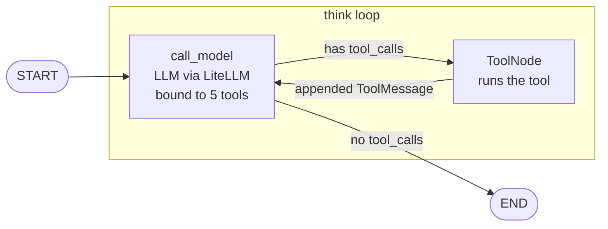

# Strata agent architecture

How the pieces in `services/agent-service/`, the k8s manifests, and
the LLM/RAG layer fit together. Companion to the topic docs
(`langchain.md`, `langgraph.md`, `litellm.md`, `rag.md`,
`bedrock.md`, `nextjs.md`); this one is project-specific.

---

## 1. The two services, in one cluster

```
                    ┌─────────────────────────────────────┐
                    │         Strata-prod EKS (or         │
                    │         strata-dev Kind in dev)     │
                    │                                     │
   user ──POST──▶   │  ┌──────────────┐                   │
   /chat           │  │ agent-       │ ──HTTP /v1──▶  ┌────────┐
   (NDJSON out) ◀──│  │ service      │              │ LiteLLM│
                    │  │ (Python,     │              │ proxy  │
                    │  │  FastAPI +   │ ◀─stream──   │ (Pod)  │
                    │  │  LangGraph)  │              └────┬───┘
                    │  └──────────────┘                   │
                    │                                     │
                    │                                     ▼
                    │                              ┌─────────────┐
                    │                              │  AWS Bedrock│
                    │                              │  Nova Pro + │
                    │                              │  Titan v2   │
                    │                              └─────────────┘
                    └─────────────────────────────────────┘
```

**Phase 2 (current):** Two Deployments in the `strata` namespace.
Both behind ClusterIP services (no external ingress yet). The user
accesses the agent via `kubectl port-forward`.

**Phase 5+ (future):** Kong in front, Zitadel for auth, the agent
exposed at `/agent/chat`. The diagram grows but the two-Pod core
stays the same.

---

## 2. The agent's data flow

For one `POST /chat` request, the lifecycle is:

```
1. uvicorn receives POST /chat with body {message, thread_id}
2. app/main.py builds a FastAPI StreamingResponse
3. _stream_chat() calls _GRAPH.invoke({"messages": [HumanMessage]})
4. The graph runs:
     START → call_model → [conditional: has tool_calls?]
       ├─ no  → END
       └─ yes → tools → call_model → ... → END
5. The final state's messages list is walked
6. For each AIMessage, emit {"type": "token"|"tool_call", ...}
   For each ToolMessage, emit {"type": "tool_result", ...}
7. Emit {"type": "done"}
8. uvicorn flushes the StreamingResponse, connection closes
```

The graph is **synchronous in Phase 2**. The LiteLLM call is the
slowest part (200–600ms for the first token). The graph itself
finishes in microseconds. Phase 5+ moves to `astream` for real
token streaming, which means each `AIMessageChunk` flows through
the NDJSON output as it's produced, not after the graph finishes.

---

## 3. The graph topology



### Node: `call_model`

```python
def call_model(state: AgentState) -> dict:
    tools = _build_tools()
    llm = get_chat_model().bind_tools(tools)
    messages = state["messages"]
    if not messages or not isinstance(messages[0], SystemMessage):
        messages = [SystemMessage(content=SYSTEM_PROMPT)] + list(messages)
    response = llm.invoke(messages)
    return {"messages": [response]}
```

Reads the current message history, prepends a system prompt if
this is the first turn, invokes the LLM, returns the response as
a partial state update.

### Node: `tools`

`ToolNode(tools)` — prebuilt in LangGraph. Looks at the last
`AIMessage`, finds any `tool_calls`, invokes the matching tool for
each, wraps the result in a `ToolMessage`, returns the messages
as a partial update.

### Edge: `START → call_model`

Always. The entry point.

### Edge: `call_model → tools | END`

`tools_condition(state)` returns `"tools"` if the last message
has `tool_calls`, else `END`. This is the only branch in Phase 2.

### Edge: `tools → call_model`

Always. The tool result goes back to the LLM for the next turn.

---

## 4. The state

```python
class AgentState(TypedDict, total=False):
    messages: Annotated[list, add_messages]
    thread_id: str
```

`messages` is the only field the LLM cares about. `thread_id` is
a correlation ID for logs; the framework ignores it.

**Phase 2 has no checkpointer.** State lives in memory for the
duration of one HTTP request. Multi-turn conversations are
replayed from scratch each time (the client sends the full
history in the `messages` body, in Phase 3+).

**Phase 6+ adds a Postgres checkpointer** (via
`langgraph-checkpoint-postgres`). The graph's `thread_id` becomes
the user/thread identifier; state persists across requests; the
client sends only the new user message, not the history.

---

## 5. The system prompt

```python
SYSTEM_PROMPT = """You are Strata, an AI co-pilot for a Kubernetes platform.
You can list, inspect, provision, and delete EKS clusters by calling
the available tools. The tool data is mocked for now; treat it as
ground truth for the user's account.

When you answer:
- Prefer tool calls over guessing. If the user asks about a cluster,
  call the right tool first, then summarize the result.
- Be concise. The user is a senior k8s/AWS engineer.
- If a tool returns an error or no rows, say so plainly.
"""
```

Phase 2 is intentionally minimal. As RAG and the orchestrator
land (Phases 3+), the prompt grows:

- **Phase 3+** — "Treat tool results as authoritative for the
  user's account; if the orchestrator returns a 404, the cluster
  does not exist."
- **Phase 4** — "You have access to retrieved Strata docs in
  the context above. Cite the path in brackets when you use
  them. If the docs don't answer the question, say so."
- **Phase 6** — "When a tool is marked as requiring confirmation,
  do not assume the user has approved it. The graph will pause
  and the UI will surface a confirmation card. Wait for the
  user's response before claiming the action is complete."

---

## 6. The tools

Five mocked tools, all in `services/agent-service/app/tools/`.
Each is a `@tool`-decorated function returning a Pydantic-shaped
dict. The docstring is the tool description that the LLM sees.

| Tool | Args | Phase 2 mock | Phase 3+ real |
|---|---|---|---|
| `list_clusters` | (none) | 3 hardcoded rows | `GET /clusters` on the orchestrator |
| `get_cluster_status` | `cluster_id: str` | lookup in mock dict | `GET /clusters/{id}` |
| `get_cluster_logs` | `cluster_id: str`, `lines: int = 20` | per-cluster log dict | `GET /clusters/{id}/logs` |
| `provision_cluster` | `name: str`, `region: str`, `k8s_version: str` | return `INITIATED` with new id | `POST /clusters` (kicks the real flow) |
| `delete_cluster` | `cluster_id: str` | return `DELETING` | `DELETE /clusters/{id}` |

Phase 6 adds `retrieve_docs(collection, query, top_k)` for RAG.

### The tool description matters

The LLM picks tools based on the description, not the function
name. A bad description = wrong tool calls. Conventions in this
codebase:

- One-line summary, then a "Use this when..." clause.
- Edge cases (NOT_FOUND, empty results).
- The shape of the return value if it's not obvious.

### The tool's `invoke` is what tests use

```python
out = list_clusters.invoke({})
```

The tests in `tests/test_tools.py` exercise each tool's
`invoke` directly. No LLM needed for tool tests.

---

## 7. The FastAPI / NDJSON bridge

`app/main.py` exposes two endpoints:

- `GET /healthz` — readiness/liveness.
- `POST /chat` — body `{message, thread_id}`, returns NDJSON.

The `/chat` endpoint:

```python
@app.post("/chat")
async def chat(req: ChatRequest) -> StreamingResponse:
    thread_id = req.thread_id or f"t-{uuid.uuid4().hex[:8]}"
    return StreamingResponse(
        _stream_chat(req.message, thread_id),
        media_type="application/x-ndjson",
    )
```

`_stream_chat` runs the graph synchronously, walks the final
state, and emits NDJSON events:

```python
async def _stream_chat(message, thread_id):
    result = _GRAPH.invoke({"messages": [HumanMessage(content=message)], "thread_id": thread_id})
    for msg in result["messages"]:
        if isinstance(msg, AIMessage):
            for tc in msg.tool_calls or []:
                yield ndjson({"type": "tool_call", "name": tc["function"]["name"], "args": json.loads(tc["function"]["arguments"])})
            if msg.content:
                yield ndjson({"type": "token", "text": msg.content})
        elif isinstance(msg, ToolMessage):
            yield ndjson({"type": "tool_result", "name": msg.name, "result": msg.content})
    yield ndjson({"type": "done"})
```

### Why NDJSON, not SSE

- `curl` reads NDJSON natively.
- Each line is self-contained; no event-id bookkeeping.
- Trivial to parse in any language.
- Easy to test with `httpx` (read the response line by line).

Phase 5+ adds an SSE adapter in the Next.js route handler
(`app/api/chat/route.ts`) that wraps the NDJSON stream for
browsers that prefer `EventSource`. The agent-service doesn't
change.

---

## 8. The LiteLLM proxy

LiteLLM is the **only thing** that knows about Bedrock. The
agent-service talks to it via the OpenAI-compatible API
(`base_url: http://litellm:4000/v1`).

```
agent-service ──ChatOpenAI(model="nova-pro", base_url="http://litellm:4000/v1")──▶ LiteLLM
                                                                                       │
                                                                                       ├─ model_list lookup
                                                                                       │   - nova-pro → bedrock/amazon.nova-pro-v1:0
                                                                                       │   - titan-embed-v2 → bedrock/amazon.titan-embed-text-v2:0
                                                                                       │
                                                                                       └─ AWS Bedrock (SigV4)
```

The agent's code never imports a Bedrock SDK, never sees an AWS
access key, never knows which region is in use. Swap LiteLLM's
`model_list` and the agent works against a different model or
provider with no code change.

See `docs/litellm.md` and `docs/bedrock.md` for the full
picture.

---

## 9. The k8s surface

Two Deployments, two ServiceAccounts, one Secret (Phase 2).

```
control-plane/manifests/
├── 00-namespace.yaml
├── 10-litellm/
│   ├── configmap.yaml           # model_list
│   ├── deployment.yaml          # LiteLLM pod + ServiceAccount
│   ├── service.yaml             # ClusterIP:4000
│   └── secret.yaml.example      # AWS creds (real secret.yaml gitignored)
└── 20-agent-service/
    ├── deployment.yaml          # agent-service pod + ServiceAccount
    └── service.yaml             # NodePort:30800
```

### How the agent gets to LiteLLM

In-cluster DNS: `http://litellm:4000`. The agent's
`LITELLM_BASE_URL` env var says exactly that. No service mesh,
no proxy, no sidecar.

### How the agent gets to AWS

Through LiteLLM, not directly. The agent has no AWS creds. LiteLLM
mounts them from `litellm-aws-credentials` Secret.

### How the user gets to the agent

Phase 2: `kubectl port-forward svc/agent-service 8080:8080`,
then `curl http://localhost:8080/chat`. The NodePort 30800 maps
to the host's 8080 via Kind's port mapping.

Phase 5+: Kong in front, exposed at `https://strata.example.com/agent/chat`.

### How the agent gets rebuilt and redeployed

```bash
make build-agent       # docker build + push to localhost:5000
make apply-agent       # kubectl apply -f 20-agent-service/
```

`imagePullPolicy: Always` on the Deployment ensures the new
image is pulled. The `image: localhost:5000/strata-agent-service:latest`
tag stays the same; we rebuild rather than bump tags.

### Why no Helm in Phase 2

Helm is overkill for two Deployments. Phase 5+ introduces the
umbrella chart in `control-plane/helm/strata/` when we have
~10 components.

---

## 10. What's missing in Phase 2

These are the next things to land. Each is a separate phase in
`AGENTS.md §4`.

- **Phase 3 — Real backend.** The five mocked tools become
  `httpx` calls to the Go orchestrator. The orchestrator has
  real Postgres and a `FakeAWS` impl. One e2e test.
- **Phase 4 — RAG.** A `retrieve` node before `call_model`. The
  `retrieve_docs` tool calls `retriever-service`, which embeds
  via LiteLLM and searches Qdrant. The `rag-indexer` Go service
  ingests clusters, alerts, and docs every 60s.
- **Phase 5 — Real EKS.** Bootstrap Terraform for Strata-prod.
  Real AWS via IRSA. The orchestrator calls the
  `provisioner-worker` Job that runs `terraform apply` for real.
  Next.js web UI and Typer CLI land here.
- **Phase 6 — SaaS.** Zitadel for OIDC. Kong for ingress/limits.
  CFN onboarding template. Cross-account IAM role. Postgres
  checkpointer for multi-turn. Confirmation UX for mutation
  tools. PLG observability.

The graph in Phase 2 is intentionally minimal. The
`tools_condition` / `ToolNode` / `END` topology is the spine;
the new nodes slot in as conditional edges in later phases.

---

## 11. What to read next

- `docs/langchain.md` — chat models, messages, tools.
- `docs/langgraph.md` — state machines, ToolNode, conditional edges.
- `docs/litellm.md` — the proxy layer.
- `docs/bedrock.md` — what's actually behind the proxy.
- `docs/rag.md` — the retrieve node (Phase 4).
- `docs/nextjs.md` — the web UI (Phase 5+).
- `AGENTS.md` — the plan, locked decisions, and phase status.
