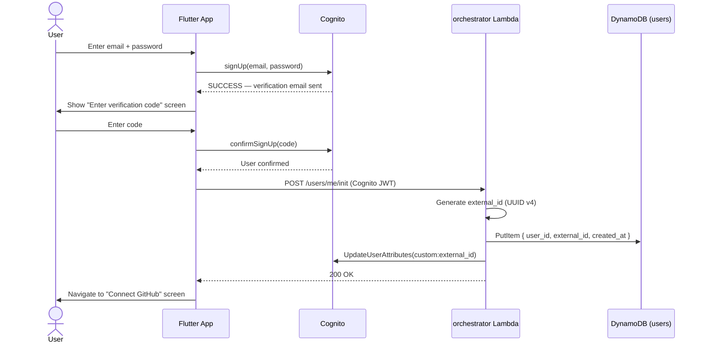
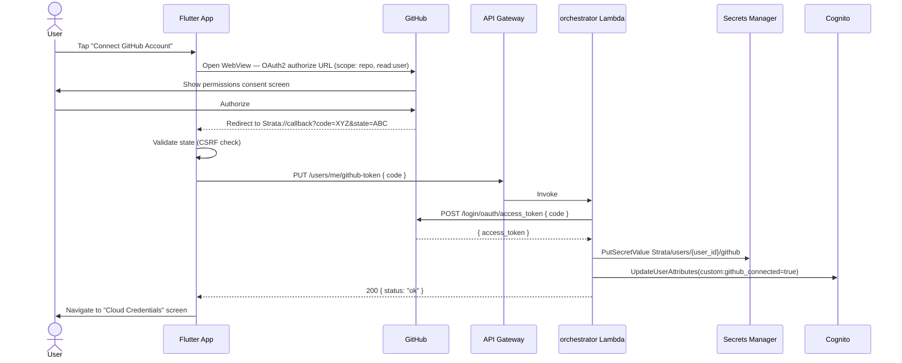
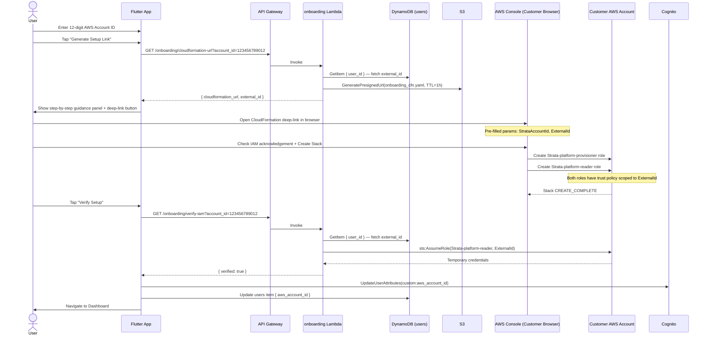
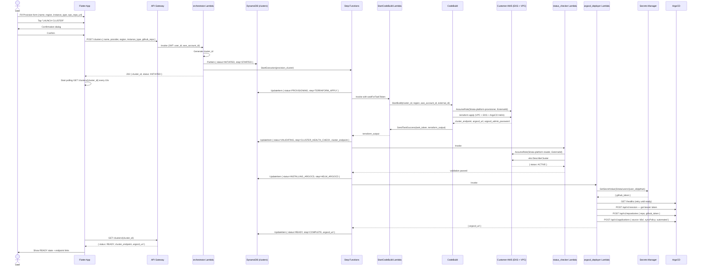
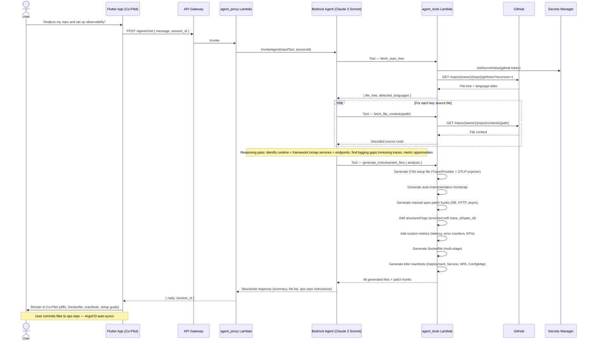
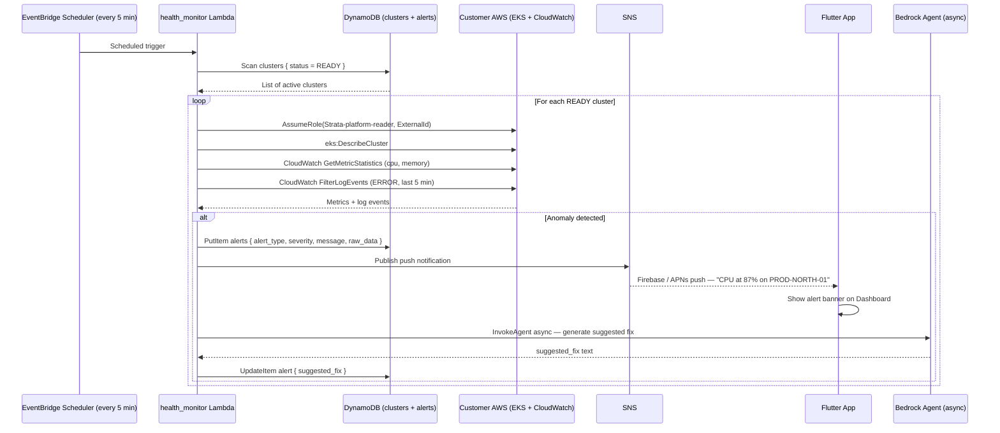
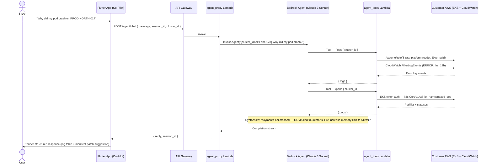
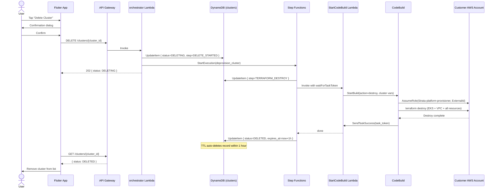

# Strata Platform — Sequence Diagrams

---

## Workflow 1 — Initial Onboarding

### 1a. Sign Up & external_id Generation

---

### 1b. GitHub OAuth2 Connection

---

### 1c. AWS IAM Setup via CloudFormation

---

## Workflow 2 — Cluster Provisioning

---

## Workflow 3 — AI Code Analysis & Instrumentation

---

## Workflow 4 — Continuous Health Monitoring

### 4a. Scheduled Proactive Checks (EventBridge)

---

### 4b. On-Demand Co-Pilot Health Queries

---

## Workflow 5 — Cluster Deprovisioning

