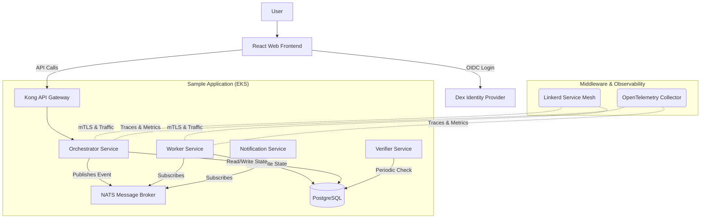

# Strata Sample Application — Architecture & Implementation

This document details the design and deployment strategy for the Sample Application used by the Strata Platform. This application acts as a target payload to validate the EKS clusters provisioned by Strata. It is designed as a cloud-native, microservices-based mirror of the serverless backend running in the AWS control plane.

---

## 1. System Overview

The application simulates the core workflows of a typical platform: receiving requests, processing background tasks, sending notifications, and running independent integrity checks.




---

## 2. Microservices Architecture

To showcase a polyglot environment common in cloud-native setups, the microservices utilize a mix of Go and Python.

### 2.1 Services Written in Go (Golang)
*Go provides high performance, minimal memory footprint, and rapid startup times, ideal for scalable, event-driven microservices.*

* **Orchestrator Service:**
  - **Function:** Serves as the primary entry point. Exposes RESTful APIs (via Fiber or Gin) to receive incoming "simulation jobs".
  - **Action:** Validates the payload, records initial state in PostgreSQL, and publishes a `job.created` event to NATS.
* **Worker Service:**
  - **Function:** The asynchronous processing engine.
  - **Action:** Listens to NATS for `job.created` events, simulates long-running tasks (via `time.Sleep`), updates job state in PostgreSQL to `COMPLETED`, and publishes a `job.completed` event to NATS.
* **Notification Service:**
  - **Function:** Handles outbound alerting.
  - **Action:** Subscribes to `job.completed` and `job.failed` events on NATS. Simulates sending an email or push notification by logging formatted, structured output.

### 2.2 Service Written in Python
*Python is retained here to mirror the Python-heavy nature of the Strata serverless backend and for its ease of use in scripting logic.*

* **Verifier Service:**
  - **Function:** A standalone cron job or long-running daemon.
  - **Action:** Periodically queries PostgreSQL directly (bypassing the Orchestrator) to find stuck jobs (e.g., jobs in a `PROCESSING` state for too long). If anomalies are found, it logs critical errors that trigger our observability alerts.

### 2.3 Web Frontend
*A modern single-page application to interact with the backend services, demonstrating API gateway routing and OIDC authentication.*

* **React (Vite) App:**
  - **Function:** Provides a UI for users to trigger simulation jobs and view their statuses.
  - **Action:** Authenticates via Dex (OIDC) and routes all backend API calls through Kong API Gateway.

---

## 3. Repository Structure

For the purpose of Strata development and testing, the sample application's source code and Kubernetes manifests will reside in a subdirectory within the main platform repository. 

*(Note: In a real-world scenario, the customer's application code would be in their own separate GitHub repository.)*

```text
sample-app/
├── services/
│   ├── catalog-service/         # Go: Service and team registry
│   │   ├── main.go
│   │   └── Dockerfile
│   ├── provisioner-service/     # Go: Infrastructure provisioning simulator
│   │   ├── main.go
│   │   └── Dockerfile
│   ├── scorecard-service/       # Go: Service health scoring
│   │   ├── main.go
│   │   └── Dockerfile
│   ├── workflow-service/        # Go: Workflow orchestration engine
│   │   ├── main.go
│   │   └── Dockerfile
│   ├── audit-service/           # Go: Audit event logging
│   │   ├── main.go
│   │   └── Dockerfile
│   └── portal-ui/              # React/Vite: Web UI
│       ├── src/
│       ├── package.json
│       └── Dockerfile
├── k8s/                        # Kubernetes manifests (ArgoCD sync target)
│   ├── apps/                   # Deployments, Services, HPAs
│   ├── infra/                  # Helm values for NATS, PostgreSQL
│   └── observability/          # OTel, Prometheus configs
├── docker-compose.yml
└── Tiltfile
```

---

## 4. Infrastructure & Middleware Specs

The sample application replaces managed AWS services (DynamoDB, SNS, SQS, API Gateway) with open-source, Kubernetes-native equivalents deployed via Helm.

### 4.1 Data & Messaging Layer
- **PostgreSQL:** Deployed via the Bitnami Helm chart. Acts as the persistent store. We will configure basic persistent volume claims (PVCs) backed by AWS EBS CSI driver.
- **NATS:** Lightweight publish-subscribe messaging system. Deployed via the NATS Helm chart. Replaces AWS EventBridge/SNS/SQS.

### 4.2 Networking & API
- **Kong Ingress Controller:** Acts as the API Gateway. Routes external HTTP traffic to the Orchestrator Service and serves the React Web Frontend.
- **Linkerd:** A lightweight service mesh. Application namespaces will be annotated with `linkerd.io/inject: enabled` to provide automatic mTLS between all application components, as well as L7 metrics.

### 4.3 Security & Identity
- **Dex:** Deployed as an OpenID Connect (OIDC) provider. It will be configured with a mock/static user store to demonstrate external authentication, handling the OAuth/OIDC login flows for the Web Frontend.
- **cert-manager:** Deployed via Helm to automatically provision and manage TLS certificates for cluster ingress and internal services.
- **Kubescape:** Deployed as a CronJob to run periodic security scans on the cluster, ensuring the generated manifests follow best practices.

### 4.4 Observability
- **OpenTelemetry (OTel):** An OTel Collector daemonset will be deployed to gather traces and metrics from the Go and Python microservices (which will be auto-instrumented).
- **Kube-Prometheus-Stack:** Provides Prometheus (metrics storage) and Grafana (dashboards).
- **Jaeger:** Deployed via the Jaeger Operator to visualize the distributed traces collected by OTel.

### 4.5 Autoscaling & FinOps
- **Karpenter:** The EKS cluster will have Karpenter installed during Terraform provisioning. The `sample-app` manifests will include an `EC2NodeClass` and a `NodePool` to dynamically spin up new instances when the Worker service is scaled up via HPA.
- **OpenCost:** Deployed via Helm to provide real-time cost monitoring of the Kubernetes workloads.

### 4.6 GitOps (ArgoCD)
- **App of Apps Pattern:** A root ArgoCD `Application` will be created pointing to the `sample-app/k8s-manifests/` directory. ArgoCD will automatically apply changes to the infrastructure configurations and application deployments, fully simulating the GitOps flow intended for Strata users.

### 4.7 Backup & Restore
- **Velero:** Deployed via Helm. Used to back up Kubernetes objects and persistent volumes, providing disaster recovery and migration capabilities for the EKS cluster.

---

## 5. Development Roadmap

To systematically build and test the sample application and its infrastructure, we will follow a phased approach:

### Phase 1: Local Docker Compose (Core Services)
- **Goal:** Validate application logic and inter-service communication without Kubernetes overhead.
- **Scope:** 
  - Build Go microservices (Orchestrator, Worker, Notification).
  - Build Python microservice (Verifier).
  - Build React Web Frontend.
  - Setup `docker-compose.yml` with PostgreSQL, NATS, and all 5 components.
- **Outcome:** Services successfully communicate, the frontend can hit the backend APIs, read/write to the database, and publish/subscribe to messages locally.

### Phase 2: Local Kubernetes (Kind Cluster)
- **Goal:** Test Kubernetes manifests and basic container orchestration.
- **Scope:**
  - Create a local `kind` (Kubernetes in Docker) cluster.
  - Write base Kubernetes manifests (Deployments, Services, ConfigMaps).
  - Deploy PostgreSQL and NATS using Helm on `kind`.
  - Deploy the microservices and verify functionality.
- **Outcome:** Application runs successfully within a local Kubernetes environment.

### Phase 3: EKS Core Integration (AWS)
- **Goal:** Deploy to the actual target environment with core ingress routing.
- **Scope:**
  - Provision a base EKS cluster.
  - Deploy Kong Ingress Controller and configure basic routing.
  - Deploy cert-manager for TLS.
  - Deploy PostgreSQL, NATS, and the microservices.
- **Outcome:** The application is accessible externally via Kong on an EKS cluster.

### Phase 4: Full Middleware & Observability Integration
- **Goal:** Complete the production-ready setup.
- **Scope:**
  - Inject Linkerd service mesh.
  - Deploy observability stack (OTel, Prometheus, Jaeger, Grafana).
  - Deploy security & finops tools (Dex, Kubescape, OpenCost).
  - Setup Velero for backup/restore.
  - Configure Karpenter for autoscaling.
  - Transition to ArgoCD GitOps sync for all components.
- **Outcome:** The sample application fully mirrors a production-ready, cloud-native architecture.
