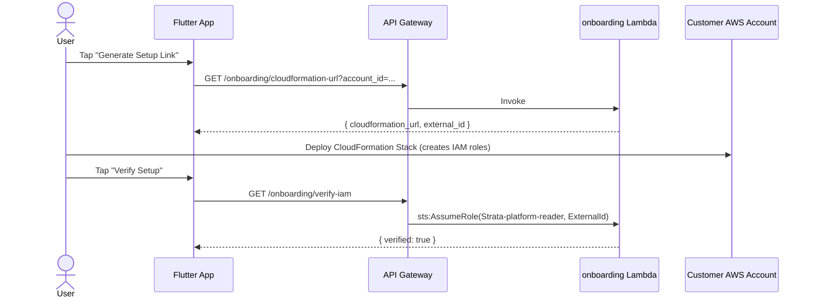
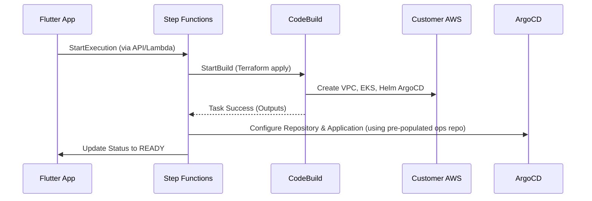

# Strata Platform — Master Design Document

## 1. Overall Idea for the App

**Platform Codename:** Strata
**Goal:** A fully managed, AI-assisted SaaS platform for developers and companies with existing GitHub codebases to create and maintain production-grade, cloud-native architectures in their own AWS accounts (with Azure and GCP planned). 

### Prerequisites:
- Users must have at least 2 repositories in GitHub: a **code repo** (their application code) and an **ops repo** (where the platform will store GitOps manifests).
- Users must have an **AWS account with root/admin access** to deploy the initial CloudFormation template that provisions the necessary IAM roles.

### Key Concepts:
- **Zero-Terminal Experience:** The platform abstracts away infrastructure management. Users only grant access to their GitHub repos and AWS accounts.
- **Continuous AI Agent:** A Bedrock AI agent continuously analyzes the codebase, auto-instruments code (OpenTelemetry), injects missing tracing/logging, generates Dockerfiles and Kubernetes manifests, and provides a natural language interface for cluster monitoring, debugging, and maintenance.
- **GitOps First:** Infrastructure is provisioned via Terraform, but application deployment is managed via ArgoCD syncing from an automatically generated "ops repo".
- **Multi-Platform Frontend:** A Flutter-based application. The web frontend (hosted on Vercel) handles onboarding (GitHub OAuth, AWS CloudFormation deep-linking), while the mobile app (Android first) is used for continuous cluster monitoring and interacting with the AI Co-Pilot.
- **Serverless Backend:** The Strata control plane is completely serverless, utilizing AWS API Gateway, Lambda, Step Functions, DynamoDB, CodeBuild, and Bedrock.
- **Demo Target:** The sample app used to test the deployment will be a Kubernetes mirror of the serverless backend.

---

## 2. Architecture Details

### Tech Stack
- **Frontend:** Flutter (Android + Web)
- **Backend Auth & API:** AWS Cognito, API Gateway, AWS Lambda (Python 3.12)
- **Database:** DynamoDB (Tables: `clusters`, `alerts`, `users`)
- **Orchestration:** AWS Step Functions, AWS CodeBuild (runs Terraform)
- **Secrets:** AWS Secrets Manager
- **Infrastructure Targets:** Amazon EKS, ArgoCD
- **AI/LLM:** Bedrock Agent (Claude 3 Sonnet)
- **Multi-cloud:** AWS v1 (live), Azure + GCP behind feature flags

### Architecture Components & Decisions
- **Cross-Account Provisioning:** Strata operates in a central control-plane AWS account. It provisions resources in the customer's AWS account by assuming IAM roles (`Strata-platform-provisioner` and `Strata-platform-reader`) created via a CloudFormation template deployed by the user during onboarding. This is secured via per-user `external_id` conditions to prevent confused deputy attacks.
- **GitHub Integration:** Uses OAuth2 (not OIDC) to get a user access token for accessing repos and pulling code context. The platform instructs users to create an "ops repo" for GitOps to avoid asking for overly broad write permissions to user organizations.
- **Orchestration Engine:** Step Functions handles the long-running EKS provisioning process. It uses CodeBuild to run Terraform (`apply` and `destroy`) and uses the `waitForTaskToken` pattern to pause the state machine until CodeBuild finishes.
- **AI Agent:** Uses AWS Bedrock Agents. An `agent_proxy` Lambda relays messages from API Gateway, and an `agent_tools` Lambda acts as the Action Group for the agent, allowing it to query EKS, CloudWatch logs, and GitHub.
- **Monitoring:** Hybrid approach. Scheduled EventBridge rules run proactive health checks (polling EKS and CloudWatch), writing to an `alerts` DynamoDB table and triggering SNS for push notifications. On-demand queries are handled by the Bedrock Co-Pilot.

---

## 3. Workflows & Sequence Diagrams

### Workflow 1: Initial Onboarding
1. **Sign Up:** User creates an account via Cognito. A unique `external_id` is generated and stored in DynamoDB and Cognito custom attributes.
2. **Connect GitHub:** User connects GitHub via OAuth2. The access token is stored securely in Secrets Manager (`Strata/users/{user_id}/github`).
3. **AWS IAM Setup:** User inputs their 12-digit AWS Account ID. The backend generates a pre-signed CloudFormation deep-link containing their `external_id`. The user deploys this in their AWS account to create cross-account IAM roles. The app verifies the setup by attempting an `sts:AssumeRole`.



### Workflow 1.5: AI Code Analysis & Manifest Generation
Triggered from the Co-Pilot screen or a dedicated "Analyze Repo" button. Before provisioning the cluster, the AI must prepare the deployment manifests.
1. The Bedrock agent uses `fetch_repo_tree` and `fetch_file_contents` tools to analyze the user's codebase iteratively.
2. The agent identifies frameworks and logging gaps, and plans auto-instrumentation (OpenTelemetry).
3. Tools used by Agent:
   - `generate_instrumented_files`: Creates OTel setup, manual spans for business-critical functions, and structured logging additions.
   - `generate_dockerfile`: Produces a multi-stage Dockerfile appropriate for the runtime, including the OTel collector.
   - `generate_k8s_manifests`: Produces Deployment, Service, HPA, ConfigMap, and Ingress to be placed in the ops repo under `k8s/`.
4. The agent provides step-by-step instructions for the user to commit these to their "ops repo" so it is ready for ArgoCD.

### Workflow 2: Cluster Provisioning
Triggered from the Flutter app. The user specifies cluster name, region, instance type, and the now-populated ops repo URL.
1. `orchestrator` Lambda writes an `INITIATED` record to DynamoDB and starts a Step Functions execution.
2. Step Functions invokes CodeBuild (running Terraform) to create VPC, EKS, and install ArgoCD via Helm.
3. A `status_checker` Lambda validates the cluster is `ACTIVE`.
4. An `argocd_deployer` Lambda configures ArgoCD to sync from the user's provided ops repo (which already contains the K8s manifests from Workflow 1.5).
5. Cluster status is marked `READY`.



### Workflow 4: Continuous Health Monitoring
- **Proactive (Mode A):** EventBridge triggers `health_monitor` Lambda every 5 mins. It queries EKS (via `sts:AssumeRole`) and CloudWatch (for CPU/Memory > 80/85%, pod crashes, error logs). High CPU/Memory or Pod crashes trigger alerts saved to the `alerts` DynamoDB table and sent via SNS push notifications.
- **Reactive (Mode B / Co-Pilot):** User asks "Why did my pod crash?". Bedrock uses `agent_tools` to fetch CloudWatch logs and Kubernetes pod statuses, synthesizes the root cause, and provides a fix in natural language.

### Workflow 5: Cluster Deprovisioning
Triggered from the app's Cluster Detail screen. `orchestrator` Lambda updates status to `DELETING` and starts a Step Functions execution that runs a CodeBuild task to execute `terraform destroy` in the customer account, followed by ArgoCD cleanup.

### Workflow 6: GitHub Token Refresh
If a user disconnects and reconnects their GitHub account via Settings, the same OAuth2 flow runs. The new token overwrites the existing secret in Secrets Manager, keeping the `custom:github_connected` Cognito attribute as `true`.

---

## 4. Detailed Specifications

### 4.1 Staged Implementation Plan (Build Order)
Build vertically (thin slices end-to-end) rather than horizontally.
1. **Stage 1 — Platform Foundation:** Terraform setup for always-on resources (Cognito, DynamoDB, S3, Secrets Manager, IAM).
2. **Stage 2 — Core API Layer:** Lambdas (`orchestrator`, `status_checker`) and API Gateway for basic endpoints.
3. **Stage 3 — Provisioning Engine:** CodeBuild (`buildspec.yml`) and Step Functions (`provision_cluster.asl.json`). *(Highest complexity)*
4. **Stage 4 — Status Reads:** Read operations from EKS and CloudWatch wired back to the Dashboard.
5. **Stage 5 — Flutter Onboarding:** UI for Sign up, GitHub OAuth, AWS CloudFormation deep-link on both Web and Android.
6. **Stage 6 — Flutter Main Screens:** Dashboard, Clusters List, Provision Screen, Detail Screen with live data.
7. **Stage 7 — Bedrock Co-Pilot:** `agent_proxy`, `agent_tools`, Bedrock schemas, and Chat UI implementation.
8. **Stage 8 — Hardening & Polish:** IAM scoping, CloudFront fronting, error handling, full system test.

### 4.2 Repository Layout
```text
Strata/
├── flutter_app/                        # Strata app — Android + Web (legacy; being replaced)
├── lambdas/
│   ├── orchestrator/                   # validate + write DDB + start SFN
│   ├── status_checker/                 # EKS API + CloudWatch queries
│   ├── argocd_deployer/                # Helm install + ArgoCD API registration
│   ├── agent_proxy/                    # Bedrock Agent relay
│   └── agent_tools/                    # K8s queries via EKS API + cloud monitors
├── infra/                              # Always-on Strata account infrastructure (Terraform)
├── terraform/                          # EKS cluster module — zipped to S3 for CodeBuild
│   ├── aws/                            # aws modules
│   ├── azure/                          # azure stub (feature flag)
│   └── gcp/                            # gcp stub (feature flag)
├── state_machines/                     # provision_cluster.asl.json & deprovision
├── buildspec.yml                       # CodeBuild — runs Terraform
└── onboarding_cfn.yaml                 # CloudFormation — customer deploys IAM roles
```

### 4.3 Database Schemas (DynamoDB)
**Table: `clusters`**
- `user_id` (PK, String) - Cognito `sub`
- `cluster_id` (SK, String) - `eks-{user_id[:8]}-{uuid[:6]}`
- `name` (String), `status` (String - INITIATED, PROVISIONING, VALIDATING, INSTALLING_ARGOCD, READY, FAILED, DELETING, DELETED), `current_step` (String), `provider` (String), `region` (String), `instance_type` (String), `aws_account_id` (String), `cluster_endpoint` (String), `argocd_url` (String), `github_repo` (String), `sfn_execution_arn` (String), `expires_at` (Number TTL).

**Table: `alerts`** (New in Workflow 3)
- `user_id` (PK, String)
- `alert_id` (SK, String)
- `cluster_id` (String), `alert_type` (String), `severity` (String), `message` (String), `raw_data` (Map), `suggested_fix` (String), `acknowledged` (Boolean).

### 4.4 API Gateway Endpoints
*(All routes authorized via Cognito JWT)*
- `POST /clusters` - Provision new cluster (orchestrator Lambda)
- `DELETE /clusters/{cluster_id}` - Deprovision cluster (orchestrator Lambda)
- `GET /clusters` - List user clusters (DynamoDB direct integration)
- `GET /clusters/{cluster_id}` - Fast status poll (DynamoDB direct integration)
- `GET /dashboard/summary` - Aggregate counts (status_checker Lambda)
- `POST /agent/chat` - Bedrock Co-Pilot (agent_proxy Lambda)
- `PUT /users/me/github-token` - Store GitHub token (orchestrator Lambda)

### 4.5 Secrets Manager Convention
All secrets encrypted with platform KMS key. Lambda IAM scopes limit access to `Strata/users/{sub}/*`.
- `Strata/users/{user_id}/aws` → `{ "account_id": "..." }`
- `Strata/users/{user_id}/azure` → `{ "tenant_id", "client_id", "client_secret", "subscription_id" }`
- `Strata/users/{user_id}/gcp` → `{ "service_account_json": "..." }`
- `Strata/users/{user_id}/github` → `{ "token": "..." }`

### 4.6 Flutter App Specifications
- **Theme:** Dark navy background (`#0A0E1A`), card surfaces (`#111827`), cyan accent (`#60A5FA`), success green (`#34D399`), warning amber (`#FBBF24`), danger red (`#F87171`).
- **Navigation:** Bottom nav has 3 tabs: Dashboard, Clusters, Co-Pilot.
- **Provider Cards (Onboarding):** AWS is fully interactive in v1. Azure and GCP show semi-transparent overlays with a `Coming Soon` badge driven by feature flags (`ENABLE_AZURE=false`, `ENABLE_GCP=false`).
- **Dashboard Screen:** Displays an Infrastructure State header (Active clusters, healthy/unhealthy counts), ArgoCD sync status, active clusters list, and recent activities feed.
- **Provision Screen:** Form with Cluster Name, Infrastructure Provider (AWS/Azure/GCP toggles), Region dropdown, Instance Type dropdown. Includes a full-width blue gradient launch button.
- **Cluster Detail Screen:** Status badge, progress stepper (INITIATED → PROVISIONING → VALIDATING → INSTALLING_ARGOCD → READY), endpoint links, and delete cluster button.
- **Co-Pilot Screen:** Chat UI with right-aligned user bubbles and left-aligned agent bubbles. Input bar with attachment button, and quick-action chips below input ("CHECK AWS LATENCY", "COST", etc.).

### 4.7 Lambda Code Highlights
- **orchestrator/handler.py:** Uses `boto3` to trigger Step Functions via `start_execution` and reads/writes to DynamoDB. Handles GitHub OAuth token persistence in Secrets Manager.
- **status_checker/handler.py:** Cross-account role assumption using `sts:AssumeRole` to hit `eks:DescribeCluster` and `cloudwatch:GetMetricStatistics` in the customer account.
- **argocd_deployer/handler.py:** Uses Python `requests` library to poll ArgoCD health, authenticate, and register the customer GitHub repo into the ArgoCD instance.
- **agent_proxy/handler.py:** Calls Bedrock Runtime (`boto3.client("bedrock-agent-runtime")`) to invoke the Claude 3 agent with streaming responses.
- **agent_tools/handler.py:** The Action Group for Bedrock. Processes API requests from the LLM, executes API calls to EKS/CloudWatch (e.g. `/health`, `/pods`, `/logs`, `/metrics`) and returns structured JSON responses to the LLM to format.
- **health_monitor/handler.py:** Triggered by EventBridge every 5 minutes. Iterates over active clusters, checks EKS status and CloudWatch metrics/logs, writes anomalies to the `alerts` DynamoDB table, and triggers SNS notifications.

## 5. Sample Application (EKS Deployment Target)

As part of testing the EKS cluster deployment, a sample application will be deployed. This application serves as a mirror image of the serverless backend running in AWS, demonstrating a cloud-native Kubernetes architecture.

### 5.1 Application Services
These services are similar in nature to their Lambda and Step Functions counterparts in the control plane, but they will simulate operations rather than perform actual ones:
- **Orchestrator Service:** Manages high-level workflows.
- **Worker Service:** Executes tasks.
- **Notification Service:** Handles alerting and messages.
- **Verifier Service:** Validates operations.

### 5.2 Infrastructure & Middleware
The architecture replaces managed AWS services with open-source, cloud-native equivalents:
- **Database:** PostgreSQL (instead of DynamoDB)
- **Event-Driven Messaging:** NATS (for communication between Orchestrator and Worker)
- **API Gateway:** Kong
- **Authentication:** Dex (instead of Cognito)
- **Service Mesh:** Linkerd
- **Observability:** OpenTelemetry (OTel), Prometheus, Jaeger, and Grafana
- **Cost & Security:** OpenCost and Kubescape
- **GitOps:** ArgoCD
- **Autoscaling:** Karpenter

This repository will be used as a sample for creating a new account EKS cluster, with the applications and tools embedded as part of the test deployment.